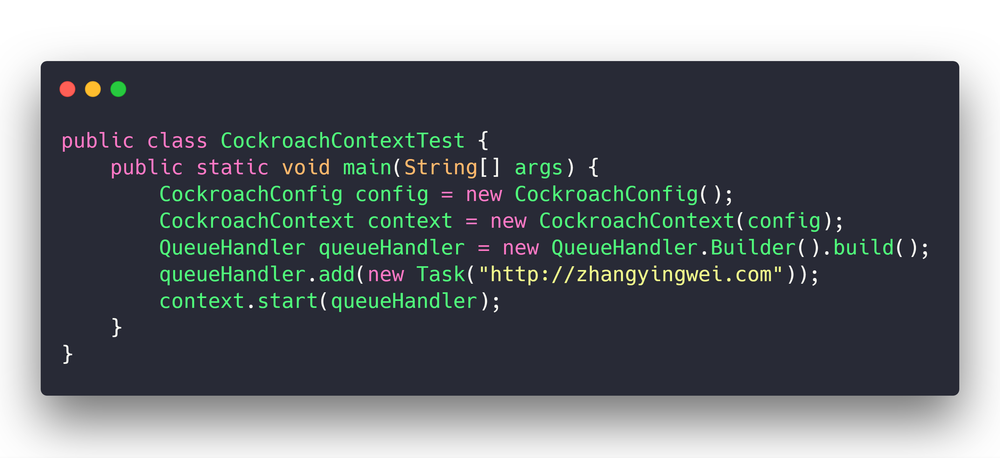
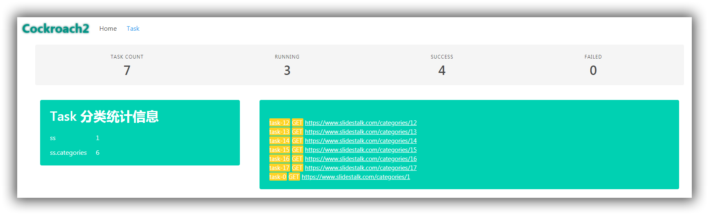

# cockroach2

[](https://travis-ci.org/zhangyingwei/cockroach2)
[]()
[]()
[](http://www.apache.org/licenses/LICENSE-2.0.html)

> 对 [cockraoch](https://github.com/zhangyingwei/cockroach) 进行完全重构，在之前一些设计不足的方面进行了补充，完成了一直以来心中所想的一个爬虫框架的一些基础功能。




## 简介

cockroach2 是 [cockraoch](https://github.com/zhangyingwei/cockroach) 的完全重构版本，因为架构设计的原因以及代码写着写着就头脑发热的原因个，cockroach在开发的过程中做了一些本不该它做的事情，同样也有一部分本该它做的事情做不到，所以犹豫了好久干脆重写了，犹豫的原因是舍不得之前那百十来个小星星，后来实在是忍不下去了，干脆一了百了，咬咬牙重头再来。

没错，还是一个小巧、灵活、健壮的爬虫框架。

简单到什么程度呢，任然是几句话就可以创建一个爬虫。

## 快速开始

### 依赖部分

```xml
<dependency>
    <groupId>com.zhangyingwei.cockroach2</groupId>
    <artifactId>cockroach2-core</artifactId>
    <version>0.0.1</version>
</dependency>
```

### 代码部分：

```java
public class CockroachContextTest {
    public static void main(String[] args) {
        CockroachConfig config = new CockroachConfig();
        CockroachContext context = new CockroachContext(config);
        QueueHandler queueHandler = new QueueHandler.Builder().withBlock(false).build();
        queueHandler.add(new Task("http://zhangyingwei.com"));
        context.start(queueHandler);
    }
}
```

没错，就是这么简单。这个爬虫就是爬取 `http://zhangyingwei.com` 这个页面的内容并将结果打印出来。
在爬虫结果处理这个问题上，程序中默认使用 PringStore 这个类将所有结果打印出来。

### 监测部分

代码中通过监听器把一系列操作以日志的形式发送到日志队列。消费日志队列即可得到程序的运行情况。添加监控程序的日志消费者，即可开启监控界面。




关于

## 联系方式
* 邮箱： zhangyw001@gmail.com
* 微信： fengche361

## Lisence

Lisenced under [Apache 2.0 lisence](./LICENSE)
